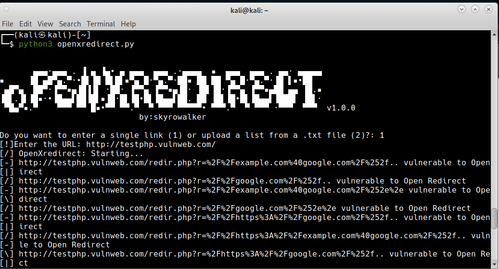

<h1 align="center">
    OpenXredirect
  <br>
</h1>

<h4 align="center">Openredirect Scanner</h4>

# Install

```sh
git clone https://github.com/skyrowalker/openxredirect
cd openxredirect
pip3 install -r requirements.txt
python3 openxredirect.py
```

# Usage



